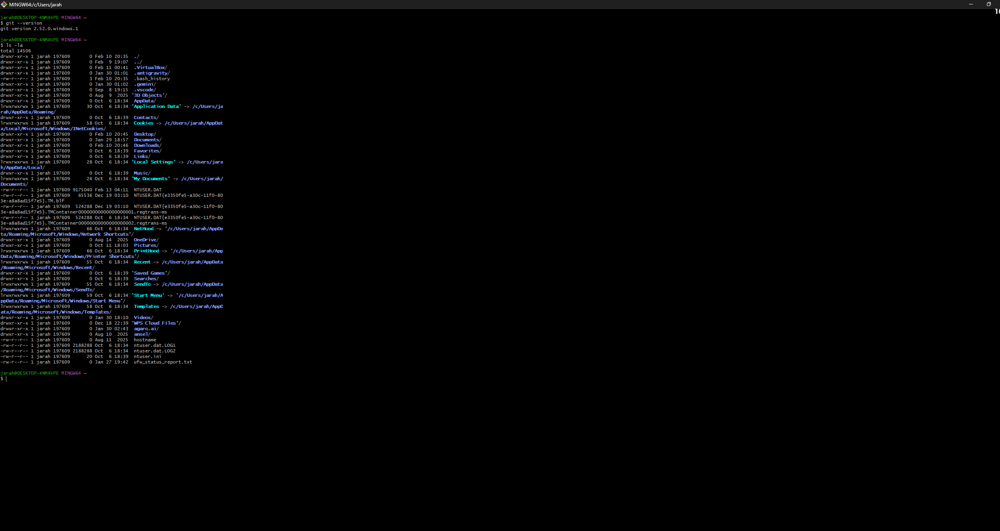

Lab 01: Infrastructure Audit

Name: Mohammed Jarah

Date: 2026-02-02

Status: Completed

🎯 Objective:
To document the 2021 Facebook outage and practice using GitHub for enterprise documentation.

🔍 Key Findings

1. The Event: Facebook went offline due to a configuration error.
2. The Technical Cause: BGP routes were accidentally removed.
3. The Impact: DNS resolvers could not locate Facebook servers.

📸 Proof of Work:

